# doc-editor 业务集成指南

产品名称为 `doc-editor`，Git 仓库名称为 `docflow`。以下文件接口使用 `/doc-editor/{docId}/content`，它属于宿主业务后端，由 `BUSINESS_DOCUMENT_CONTENT_PATH` 配置，并非编辑器提供的路由。其他业务系统也可使用各自已实现的文件接口路径。

集成架构图：

```mermaid
flowchart LR
    subgraph FRONTEND["① LegalAI 前端服务"]
        PAGE["合同审查测试页面"]
        SDK["doc-editor SDK"]
        IFRAME["编辑器 iframe"]
        PAGE --> SDK --> IFRAME
    end

    subgraph OFFICE["② LegalOffice / doc-editor 服务"]
        NGINX["LegalOffice Nginx<br/>legaloffice.lenovo.com"]
        SESSION["编辑会话接口<br/>POST /api/integrations/legalai/session"]
        EDITOR["doc-editor<br/>DOCX解析与在线编辑"]
        DRAFT[("doc-editor草稿存储<br/>HTML + DOCX + rev")]
        COMMIT["正式保存接口<br/>POST /api/documents/{docId}/commit"]

        NGINX --> SESSION
        NGINX --> EDITOR
        EDITOR <--> DRAFT
        EDITOR --> COMMIT
    end

    subgraph BACKEND["③ LegalAI 后端服务"]
        AUTH["LoginInterceptor<br/>校验业务Token"]
        DOC_EDITOR_GET["doc-editor下载接口<br/>GET /doc-editor/{docId}/content"]
        DOC_EDITOR_POST["doc-editor发布接口<br/>POST /doc-editor/{docId}/content"]
        PUBLISH["FilezServiceImpl.publishDoc()"]

        AUTH --> DOC_EDITOR_GET
        AUTH --> DOC_EDITOR_POST
        DOC_EDITOR_POST --> PUBLISH
    end

    subgraph STORAGE["④ LegalAI 数据与文件存储"]
        DB[("PostgreSQL<br/>合同业务信息和元数据")]
        S3[("S3<br/>{docId}.docx")]
    end

    IFRAME -->|"docId + LegalAI Token"| NGINX
    SESSION -->|"携带业务Token下载原合同"| AUTH
    DOC_EDITOR_GET -->|"读取"| S3
    S3 -->|"返回DOCX"| DOC_EDITOR_GET
    DOC_EDITOR_GET -->|"DOCX"| SESSION
    SESSION -->|"文档级临时令牌 + 编辑器页面"| IFRAME

    COMMIT -->|"最新DOCX + LegalAI Token"| AUTH
    PUBLISH -->|"更新modifier、modifiedTime"| DB
    PUBLISH -->|"覆盖当前合同文件"| S3
```



主要改动思路如下：

1. 业务文档初始化

   - LegalAI 前端通过 SDK 传入业务 `docId`、LegalAI Token、合同名称等信息。
   - doc-editor 携带 Token 调用 LegalAI 现有下载接口。
   - LegalAI 校验用户身份和合同权限，并从 S3 返回 DOCX。
   - doc-editor 解析 DOCX，生成编辑状态并展示。
   - `docId` 直接使用 LegalAI 合同 ID，不再维护额外的随机 ID 映射。

2. 文档权限控制

   - LegalAI Token 用于下载合同和正式回写。
   - doc-editor 根据验证结果签发短期文档级令牌。
   - 文档级令牌只能操作指定合同，用于编辑器内部接口和 WebSocket。

3. 保存逻辑

   保存分为两种：

   - 内部自动保存：保存 doc-editor 草稿，不调用 LegalAI，不回写 S3。
   - 正式保存：生成最新 DOCX，通过 LegalAI 现有 FileZ 接口覆盖写入 S3。

   正式保存由以下操作触发：

   - 点击保存按钮
   - `Ctrl+S`
   - SDK `save()`
   - SDK `close()`
   - 正常离开合同审查页面
   - 服务端定时保存，当前默认关闭

4. 复用 LegalAI 现有接口

   doc-editor 直接复用：

   ```
   GET  /doc-editor/{docId}/content    下载合同
   POST /doc-editor/{docId}/content    保存合同
   ```

   正式保存后，LegalAI 继续按照原有 FileZ 逻辑：

   - 更新合同修改人和修改时间
   - 覆盖写入 S3 中的 `{docId}.docx`
   - 返回 `modified_at`、`size` 等元数据

5. `docflow` 仓库中的 doc-editor 集成主要改动如下：

   1. 新增 LegalAI 初始化接口

      ```
      POST /api/integrations/legalai/session
      ```

      根据业务 `docId` 和 Token 从 LegalAI/S3 下载并解析合同。

   2. 新增正式保存接口

      ```
      POST /api/documents/{docId}/commit
      ```

      生成最新 DOCX，并调用 LegalAI 接口覆盖回写 S3。

   3. 增加鉴权机制

      - LegalAI Token 用于下载和正式保存。
      - 新增文档级临时令牌，用于编辑器接口和 WebSocket。

   4. 调整保存机制

      - 内部自动保存只保存 doc-editor 草稿。
      - 保存按钮、`Ctrl+S`、SDK `save/close` 才通过 LegalAI 接口正式回写业务文档。
      - 定时回写可配置，当前关闭。

   5. 扩展 SDK

增加 `businessToken`、业务 `docId`、`save()`、`close()` 和文档令牌续期支持。

6. 当前功能边界

   - doc-editor 可以保留内部历史快照；当前 LegalAI 测试页通过 `history: false` 隐藏历史按钮。
   - 每次正式保存仍覆盖 LegalAI 当前业务文档，不创建新的 LegalAI 业务版本。
   - `.docx` 支持正常加载和保存。
   - 删除 LibreOffice 后，旧 `.doc` 文件暂不支持自动转换。
   - 浏览器异常关闭无法保证完成异步保存；正常页面跳转会等待保存完成。

7. 当前成果及后续工作

   当前文件存储链路已打通，已实现文本编辑器基本功能：打开文件，存储文件，查询， 高亮，编辑。后续仍需继续测试，查漏补缺，完善功能细节。定版后进行正式集成。

8. 可通过审查历史页的doc-editor集成测试按钮进行测试。

9. 当前 LegalAI 接口调用关系

   | 发起方 | 接收方 | 接口 | 触发时机 | 作用 |
   |---|---|---|---|---|
   | LegalAI 前端页面 | doc-editor 静态服务 | `GET /js/sdk.js` | 进入合同审查测试页 | 加载嵌入 SDK |
   | doc-editor iframe | doc-editor Node 服务 | `POST /api/integrations/legalai/session` | 每次打开或刷新编辑器令牌 | 使用 `docId + businessToken` 初始化会话 |
   | doc-editor Node 服务 | LegalAI 后端 | `GET /doc-editor/{docId}/content` | 初始化会话 | 校验 LegalAI Token 并下载业务 DOCX |
   | doc-editor iframe | doc-editor Node 服务 | `GET /api/documents/{docId}` | 会话初始化成功后 | 读取解析后的 HTML 草稿和 revision |
   | doc-editor iframe | doc-editor Node 服务 | `PUT /api/documents/{docId}` | 编辑后自动保存 | 保存本地草稿，使用 `baseRev` 检测冲突 |
   | doc-editor iframe | doc-editor Node 服务 | `WS /ws` | 编辑器打开期间 | 同一服务实例内的在线状态和编辑同步 |
   | doc-editor iframe | doc-editor Node 服务 | `POST /api/documents/{docId}/commit` | 保存按钮、`Ctrl+S`、SDK `save()/close()` | 生成最新 DOCX 并发起正式回写 |
   | doc-editor Node 服务 | LegalAI 后端 | `POST /doc-editor/{docId}/content` | 正式保存 | 覆盖业务 DOCX，并由 LegalAI 更新业务元数据 |

   LegalAI 业务后端不会主动调用 doc-editor 的 `/api/*`。它只接收 doc-editor Node 服务发起的 `/doc-editor/{docId}/content` 下载和保存请求。原 `/zOffice/{docId}/content` 接口继续保留，仅用于兼容既有 FileZ 链路。

10. REST 接口与 LegalAI 接入的关系

   REST 不是另一种业务系统集成方案，而是 doc-editor 暴露编辑能力的一种 HTTP 调用方式。例如文档列表、内容读取、页面设置和历史版本都可以通过 REST 操作。当前 LegalAI 页面主要使用 iframe SDK；SDK 内部仍会通过 REST 保存草稿、读取文档和正式提交。

   - `POST /api/documents/import`：供 doc-editor 独立页面导入本地 `.docx/.doc` 文件；当前 LegalAI 链路不调用。
   - `public/js/api-client.js`：供脚本或无 iframe 页面直接操作编辑器数据；当前 LegalAI 页面不使用。
   - 内容、格式化、批注、页面设置等 REST 接口暂时保留，待产品确认是否支持脚本化调用后再决定是否精简。
