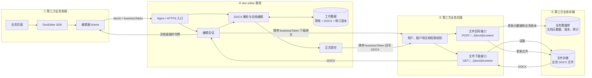

# doc-editor 第三方业务系统集成部署指南

面向需要在自身页面中嵌入文档编辑器的第三方业务系统开发、部署和运维团队。目标是完成“打开业务文档 → 在线编辑 → 保存回业务系统 → 安全关闭”的完整流程。

## 1. 快速接入需要准备什么

第三方业务系统需要完成三项工作：

1. **后端提供文件接口**：同一路径支持 GET 下载原文和 POST 接收编辑后的 DOCX，见第 2 节。
2. **部署编辑器服务**：配置业务接口地址、签名密钥、数据目录及 HTTPS/iframe 访问策略，见第 3、4 节。
3. **前端嵌入 SDK**：取得业务访问凭证，传入文档 ID，处理就绪、保存和关闭，见第 5 节。

业务系统继续负责用户身份、文档权限、正式文件存储及业务版本。doc-editor 负责编辑、草稿、生成 DOCX 和调用业务文件接口，不要求业务系统更换已有数据库或对象存储。

### 集成架构



第三方业务系统负责用户身份、访问控制、正式文件和业务版本；doc-editor 负责 iframe 中的编辑体验、工作草稿和 DOCX 转换。业务前端只需从自身后端取得 `docId` 与 `businessToken` 后初始化 SDK；业务文件的下载和正式回写均由编辑器服务按第 2 节约定调用业务后端。

本文使用以下示例配置：

| 项目             | 示例值                                   | 由谁提供                     |
| ---------------- | ---------------------------------------- | ---------------------------- |
| 业务前端地址     | `https://app.example.com`                | 业务系统                     |
| 编辑器外部地址   | `https://editor.example.com`             | 部署方，浏览器可访问         |
| 业务后端基础地址 | `https://api.example.com`                | 业务系统，编辑器容器可访问   |
| 文件接口路径     | `/integration/documents/{docId}/content` | 业务系统                     |
| 文档 ID          | `tenant42_document1001`                  | 业务系统，映射到已有业务文档 |

部署采用单实例、独立域名根路径。当前前端使用 `/api/...`、`/js/...`、`/ws` 等绝对路径，不支持仅将 `baseUrl` 改为 `/editor` 就完成子路径部署。协作房间和业务会话保存在进程内，不能直接通过增加副本数实现高可用。

## 2. 实现业务后端文件接口

### 2.1 URL、文档 ID 与鉴权约定

编辑器将下列配置拼接为下载和保存地址：

```text
BUSINESS_API_BASE_URL + BUSINESS_DOCUMENT_CONTENT_PATH
```

例如 `https://api.example.com` 加 `/integration/documents/{docId}/content`。`{docId}` 会替换为编码后的文档 ID，GET 和 POST 使用同一地址。

文档 ID 仅支持 `A–Z`、`a–z`、`0–9`、下划线和连字符，长度为 1–128。**同一个编辑器实例内必须全局唯一**，并由业务后端映射到实际文件。当前文件存储和协作房间按 `docId` 区分.

每次调用业务接口，编辑器都会按以下形式传递前端提供的 `businessToken`：

```http
X-Editor-Token: <businessToken>
```

`X-Editor-Token` 是本文的配置示例，对应 `BUSINESS_TOKEN_HEADER`。如果现有后端使用 `token`，可将配置改为 `token`；如果使用 `Authorization`，`businessToken` 必须包含完整的 `Bearer ...` 值，编辑器不会自动补此前缀。

业务后端必须校验凭证对应的用户、租户、目标文档及操作权限：GET 检查读取权限，POST 检查写入权限。可以签发仅允许访问指定文档的业务凭证。

### 2.2 GET：下载待编辑文件

```http
GET /integration/documents/tenant42_document1001/content
X-Editor-Token: <businessToken>
Accept: application/vnd.openxmlformats-officedocument.wordprocessingml.document
```

成功响应必须是**文件二进制**：

```http
HTTP/1.1 200 OK
Content-Type: application/vnd.openxmlformats-officedocument.wordprocessingml.document
Content-Disposition: attachment; filename="document.docx"

<DOCX binary>
```

不要返回 JSON 包装、base64 字符串、对象存储 URL 或登录页面。编辑器需要直接解析响应中的文件。无权限、文件不存在等情况应返回适当的非 2xx 状态。

当前业务文件下载上限为 64 MiB；还需按实际文档大小、转换时间和内存消耗设置业务服务及代理限制。

### 2.3 POST：保存编辑后的 DOCX

```http
POST /integration/documents/tenant42_document1001/content
X-Editor-Token: <businessToken>
X-Doc-Editor-Save-Reason: manual
Content-Type: multipart/form-data; boundary=...
```

| 项目       | 约定                                                                    |
| ---------- | ----------------------------------------------------------------------- |
| 文件字段名 | `file`                                                                  |
| 文件类型   | DOCX 二进制，文件名以 `.docx` 结尾                                      |
| 目标文档   | URL 中的 `docId`，由业务后端映射到业务文件                              |
| 保存原因   | `X-Doc-Editor-Save-Reason`，可为 `manual`、`close`、`timer`、`pagehide` |

业务后端接收文件后，应完成文件落库/对象存储更新及所需的业务版本处理，再返回成功。建议成功响应为：

```json
{ "code": 0, "msg": "saved" }
```

编辑器接受 2xx 响应；JSON 包含 `code` 时，只有数值 `0` 或字符串 `"0"` 视为成功。`{"code":200}` 会被判为失败，只有 `{"success":false}` 而没有失败 HTTP 状态或非零 `code` 则不会被识别为失败。后端应统一响应语义，避免“接口成功、文件未保存”。

业务后端应允许相同内容重试，避免重复保存造成非预期业务副作用。当前回写协议没有业务文件版本号或 ETag 前置条件；如果其他渠道也会修改同一文件，应由业务系统控制编辑锁或处理版本冲突。

即使原文件是 DOC/DOT，编辑后回写的也是 DOCX；业务系统应同步更新扩展名、媒体类型和文件元数据。

## 3. 部署编辑器服务

获取我们提供的源码包，在服务器安装 Docker 和 Docker Compose 后即可部署。

### 3.1 准备运行目录

建议目录：

```text
/opt/doc-editor/
├── services/                  # 本仓库代码及下方部署配置
│   ├── dockflow.zip
└── data/                      # 编辑器工作数据
```

将交付的代码放入 `services`，创建可供容器写入的 `data` 目录。

### 3.2 配置环境变量

在 Linux 服务器上进入 `services` 目录，从模板创建 `.env`：

```bash
cd /opt/doc-editor/services
cp .env.example .env
```

然后编辑 `.env`，填写本环境的 `BUSINESS_API_BASE_URL`、`BUSINESS_DOCUMENT_CONTENT_PATH` 和 `BUSINESS_TOKEN_HEADER`：

```bash
vi .env
```

#### 生成 TOKEN_SECRET

为每个环境生成独立的随机密钥，并写入 `.env`：

```bash
TOKEN_SECRET="$(openssl rand -hex 32)"
sed -i "s/^TOKEN_SECRET=.*/TOKEN_SECRET=${TOKEN_SECRET}/" .env
chmod 600 .env
```

`TOKEN_SECRET` 只在编辑器服务端签发和验证短期文档令牌，不能作为业务用户凭证。`.env` 不应提交到代码仓库或随日志交付。生产环境也可由部署平台注入相同环境变量。

### 3.3 确认 Compose 文件

```yaml
services:
  doc-editor:
    build:
      context: .
      dockerfile: Dockerfile
    image: doc-editor:local
    ports:
      - "127.0.0.1:3001:3001"
    volumes:
      - ../data:/app/data
    environment:
      HOST: "0.0.0.0"
      PORT: "3001"
      DATA_DIR: "/app/data"
      TOKEN_SECRET: "${TOKEN_SECRET:?Set TOKEN_SECRET in .env}"
      BUSINESS_API_BASE_URL: "${BUSINESS_API_BASE_URL:?Set the business API URL}"
      BUSINESS_DOCUMENT_CONTENT_PATH: "${BUSINESS_DOCUMENT_CONTENT_PATH:?Set the business content path}"
      BUSINESS_TOKEN_HEADER: "${BUSINESS_TOKEN_HEADER:-X-Editor-Token}"
      BUSINESS_REQUEST_TIMEOUT_MS: "30000"
      BUSINESS_AUTO_COMMIT_ENABLED: "false"
      VERSION_HISTORY_ENABLED: "false"
      STARTUP_DRAFT_PURGE_ENABLED: "true"
      DATA_RETENTION_HOURS: "24"
      DATA_CLEANUP_INTERVAL_MS: "86400000"
      DISK_CHECK_INTERVAL_MS: "300000"
      DISK_WARNING_PERCENT: "70"
      DISK_CRITICAL_PERCENT: "85"
    restart: unless-stopped
```

环境变量含义：

| 参数                             | 含义                                                |
| -------------------------------- | --------------------------------------------------- |
| `HOST` / `PORT`                  | 容器内服务的监听地址与端口。                        |
| `DATA_DIR`                       | 编辑器草稿、历史和生成文件的工作目录。              |
| `TOKEN_SECRET`                   | 用于签发、验证短期文档令牌的服务端密钥。            |
| `BUSINESS_API_BASE_URL`          | 业务后端的基础地址。                                |
| `BUSINESS_DOCUMENT_CONTENT_PATH` | 业务文件下载和回写路径，`{docId}` 会替换为文档 ID。 |
| `BUSINESS_TOKEN_HEADER`          | 调用业务文件接口时携带业务凭证的请求头名称。        |
| `BUSINESS_REQUEST_TIMEOUT_MS`    | 编辑器请求业务文件接口的超时时间，单位为毫秒。      |
| `BUSINESS_AUTO_COMMIT_ENABLED`   | 是否启用定时将草稿正式回写到业务系统。              |
| `VERSION_HISTORY_ENABLED`        | 是否在编辑器工作目录中保留版本历史。                |
| `STARTUP_DRAFT_PURGE_ENABLED`    | 是否在服务启动时清理草稿正文和历史数据。            |
| `DATA_RETENTION_HOURS`           | 非活动工作数据的最长保留时间，单位为小时。          |
| `DATA_CLEANUP_INTERVAL_MS`       | 执行过期工作数据清理的时间间隔，单位为毫秒。        |
| `DISK_CHECK_INTERVAL_MS`         | 检查工作目录磁盘占用的时间间隔，单位为毫秒。        |
| `DISK_WARNING_PERCENT`           | 磁盘占用达到该百分比时记录告警。                    |
| `DISK_CRITICAL_PERCENT`          | 磁盘占用达到该百分比时记录严重告警。                |

SELinux 启用的部署环境如需卷重标记，可按主机策略将数据挂载写为 `../data:/app/data:Z`。

启动并验证服务：

```bash
cd /opt/doc-editor/services
docker compose config --quiet
docker compose up -d --build
docker compose ps
docker compose logs --tail=100 doc-editor
curl -fsS http://127.0.0.1:3001/api/health
curl -fsS http://127.0.0.1:3001/version
```

按主机权限需要使用 `sudo`。健康接口返回 `{"ok":true,...}` 说明进程可访问；`/version` 展示 `package.json` 中的版本号。

### 3.4 可选：内网 CA 和旧版 Word 格式

报错：

```
LegalAI request failed (UNABLE_TO_GET_ISSUER_CERT_LOCALLY): unable to get local issuer certificate。
```

容器无法访问业务后端，证书验证错误。

业务后端使用私有 CA 时，将其 CA 证书文件只读挂载到容器，并在 Compose 中设置：

```yaml
# 请替换正式证书路径和名称，合并到上述服务已有的 volumes、environment 中
volumes:
  - ../data:/app/data
  - /path/to/business-ca.pem:/etc/ssl/certs/business-ca.pem:ro
environment:
  NODE_EXTRA_CA_CERTS: "/etc/ssl/certs/business-ca.pem"
```

这是对现有配置的补充，不是完整替换。挂载 CA 证书，不需要业务服务的私钥；不要通过关闭 TLS 校验解决证书错误。

**DOCX 原生支持；DOC/DOT 需要服务器安装 LibreOffice 后转换导入。** 当前 `Dockerfile` 未安装 LibreOffice。仅配置 `SOFFICE_PATH=/usr/bin/soffice` 不会安装转换器。确需支持旧格式时，在自有镜像构建中安装 LibreOffice，并在容器内用 `soffice --version` 验证后再提供此能力；缺少转换器时会返回 501。

## 4. 配置 HTTPS、iframe 和 WebSocket

浏览器需要访问编辑器外部地址，例如开发环境的 `https://legaloffice.lenovo.com`；编辑器容器需要访问 `BUSINESS_API_BASE_URL`。

以下为 Nginx 的 `http` 上下文配置片段，适用于 Nginx 与编辑器容器运行在同一宿主机。示例对应当前开发环境的域名和 iframe 白名单；其他环境应替换域名、证书路径和业务页面来源。Nginx 在其他机器或容器内时，应将 `proxy_pass` 改为可达的编辑器上游地址。

```nginx
map $http_upgrade $connection_upgrade {
    default upgrade;
    ''      close;
}

server {
    listen 80;
  server_name legaloffice.lenovo.com;
    return 301 https://$host$request_uri;
}

server {
    listen 443 ssl;
    server_name legaloffice.lenovo.com;
    # 浏览器访问编辑器的 Nginx TLS 证书地址。
    ssl_certificate     /home/aiadmin/nginx-1.27.2/conf/certs/legaloffice.crt;
    ssl_certificate_key /home/aiadmin/nginx-1.27.2/conf/certs/legaloffice.key;
    ssl_protocols TLSv1.2 TLSv1.3;
    ssl_session_cache shared:SSL:10m;
    ssl_session_timeout 10m;
    client_max_body_size 64m;

    # 可嵌入编辑器 iframe 的业务页面来源。按实际环境收紧白名单。
    set $doc_editor_frame_ancestors "'self' http://localhost:* https://*.t-sy-in.earth.xcloud.lenovo.com https://legal-ai-demo.lenovo.com";

    location / {
        proxy_pass http://127.0.0.1:3001;
        proxy_http_version 1.1;

      # 应用默认返回 SAMEORIGIN；跨域 iframe 必须隐藏该响应头。
      proxy_hide_header X-Frame-Options;
      add_header Content-Security-Policy "frame-ancestors $doc_editor_frame_ancestors" always;

        proxy_set_header Host $host;
        proxy_set_header X-Real-IP $remote_addr;
        proxy_set_header X-Forwarded-For $proxy_add_x_forwarded_for;
        proxy_set_header X-Forwarded-Proto $scheme;
        proxy_set_header Upgrade $http_upgrade;
        proxy_set_header Connection $connection_upgrade;
        proxy_connect_timeout 30s;
        proxy_read_timeout 300s;
        proxy_send_timeout 300s;
        proxy_buffering off;
    }
}
```

检查并重载：

```bash
nginx -t
nginx -s reload
curl -fsSI https://legaloffice.lenovo.com/
curl -fsS https://legaloffice.lenovo.com/api/health
```

## 5. 业务前端嵌入 SDK

### 5.1 由业务前端拼接参数

业务前端应取得以下数据。下面的 `/api/editor-launch` **是第三方自行实现的示例接口，不是编辑器内置接口**。

```json
{
  "baseUrl": "https://editor.example.com",
  "docId": "tenant42_document1001",
  "documentTitle": "示例文档",
  "fileType": "docx",
  "tenantId": "tenant42",
  "businessToken": "document-scoped-business-credential",
  "user": "张三"
}
```

`businessToken` 是第 2 节业务文件接口接受的凭证，不是编辑器签发的短期令牌。

业务凭证有效期应覆盖编辑会话。iframe 会在编辑器令牌到期前尝试刷新，但仍使用最初传入的业务凭证，不会自动刷新业务系统登录态；凭证失效后需由业务系统重新取得凭证并安排重新打开。

### 5.2 最小页面示例

下面示例假设页面位于业务系统域名下，`/api/editor-launch` 通过当前业务登录会话鉴权。根据业务系统约定调整该请求，并将关闭动作接入弹窗关闭或路由离开流程。

```html
<div id="editor-holder" style="height:80vh;min-height:500px"></div>
<p id="editor-status" role="status">正在打开文档…</p>
<button id="save-editor" disabled>保存</button>
<button id="close-editor" disabled>保存并关闭</button>
<script src="https://editor.example.com/js/sdk.js"></script>
<script type="module">
  const status = document.getElementById("editor-status");
  const saveButton = document.getElementById("save-editor");
  const closeButton = document.getElementById("close-editor");
  let editor;
  let ready = false;
  let busy = false;

  function updateButtons() {
    saveButton.disabled = closeButton.disabled = !ready || busy;
  }

  async function openEditor() {
    const response = await fetch("/api/editor-launch?documentId=1001", {
      credentials: "same-origin",
    });
    if (!response.ok) throw new Error("无法取得文档打开参数");
    const launch = await response.json();
    editor = DocEditor.init({
      container: "#editor-holder",
      baseUrl: launch.baseUrl,
      docId: launch.docId,
      documentTitle: launch.documentTitle,
      fileType: launch.fileType,
      tenantId: launch.tenantId,
      businessToken: launch.businessToken,
      user: launch.user,
      locale: "zh",
      mode: "edit",
      history: true,
      onReady(info) {
        ready = true;
        status.textContent = `已打开：${info.title}`;
        updateButtons();
      },
      onChange() {
        status.textContent = "有修改，请保存到业务系统";
      },
      onSave(info) {
        status.textContent =
          info.result?.skipped === "not-legalai"
            ? "仅保存了编辑器草稿，请检查业务会话配置"
            : "已保存到业务系统";
      },
      onError(error) {
        status.textContent = error.message || "编辑器发生错误";
      },
    });
  }

  async function saveEditor(closeAfterSave) {
    if (!ready || busy) return;
    busy = true;
    updateButtons();
    try {
      const result = closeAfterSave
        ? await editor.close()
        : await editor.save();
      if (result.result?.skipped === "not-legalai") {
        throw new Error("未建立业务文档会话，尚未回写业务文件");
      }
      if (closeAfterSave) {
        editor.destroy();
        ready = false;
        status.textContent = "已保存并关闭";
        // 在这里关闭业务弹窗或离开当前业务页面。
      }
    } catch (error) {
      status.textContent = `保存失败，编辑器仍保留：${error.message}`;
    } finally {
      busy = false;
      updateButtons();
    }
  }

  saveButton.addEventListener("click", () => saveEditor(false));
  closeButton.addEventListener("click", () => saveEditor(true));
  openEditor().catch((error) => {
    status.textContent = error.message;
  });
</script>
```

`DocEditor.init()` 同步返回实例，文档尚在加载，必须等 `onReady` 后再调用内容操作。多数 SDK 命令超时为 15 秒，`save()` 和 `close()` 为 60 秒；网络超时后应核对业务保存结果再重试。

`mode: 'view'` 仅控制编辑器 UI，不是服务端只读授权；业务接口仍须校验权限。`history: false` 仅隐藏历史入口，服务端是否记录历史由 `VERSION_HISTORY_ENABLED` 决定。

### 5.3 SDK 自动完成的会话流程

传入 `docId` 和 `businessToken` 后，无需业务前端自行下载文件或预先导入：

1. SDK 创建 iframe，并将业务凭证放入 URL fragment；编辑器读取后清除 fragment。
2. iframe 调用编辑器的 `POST /api/integrations/legalai/session`。
3. 编辑器服务使用业务凭证调用第 2 节 GET，解析 DOCX，创建或复用该文档的编辑会话。
4. 编辑器签发有效期为 1 小时的文档令牌，iframe 自动用于当前文档 REST 请求和 WebSocket；临近过期自动尝试续期。
5. `save()` / `close()` 先保存草稿，再调用 `POST /api/documents/{id}/commit`，由编辑器服务向业务后端 POST DOCX。

当前路由中的 `legalai`、`X-LegalAI-Token`、回调中的 `skipped: "not-legalai"` 是现有协议名称。第三方使用 `BUSINESS_*` 即可接入，不需要运行同名业务系统，也不要自行改写这些内置路由。当前版本没有供本流程使用的 `/api/auth/token` 或 `SAVE_WEBHOOK_URL` 配置入口；正式回写使用上述固定 GET/POST 文件协议。

## 6. 明确保存与关闭的语义

| 操作                       | 实际行为                               | 业务系统如何处理                 |
| -------------------------- | -------------------------------------- | -------------------------------- |
| 输入时自动保存             | 保存编辑器工作草稿                     | 不显示为“正式文件已更新”         |
| `onChange`                 | 文档变动通知                           | 用于提示待保存                   |
| 保存按钮、Ctrl+S、`save()` | 刷新草稿后正式回写业务 DOCX            | 等待成功结果；失败允许重试       |
| `close()`                  | 以 `close` 原因正式保存，不移除 iframe | 成功后再关闭页面/弹窗            |
| `destroy()`                | 移除 iframe 和监听，不保存             | 必须放在保存成功之后             |
| `onSave`                   | 正式保存流程完成的事件，包含 `result`  | 在有效业务会话中确认业务保存结果 |
| 下载/导出文件              | 向用户提供文件                         | 不等同于更新业务系统原文件       |

默认 `BUSINESS_AUTO_COMMIT_ENABLED=false`。如启用定时正式保存，可设置 `BUSINESS_AUTO_COMMIT_INTERVAL_MS`，默认 300000 毫秒，最小 60000 毫秒；这会增加业务文件写入频率，并依赖仍然有效的业务会话凭证。

浏览器刷新、关页和 `pagehide` 无法保证异步保存完成。业务弹窗关闭、路由切换应统一等待 `close()`，失败时保留编辑器并提示用户；不能先卸载组件再等待保存。`onCommentDelete({id})` 只表示本地删除批注并安排保存，不代表业务文件已更新。

## 7. 工作数据、运维与能力边界

- **正式存储**：业务系统是正式文件来源和最终存储；`/app/data` 存放编辑器草稿、版本及生成文件，不应当作业务文档永久库。
- **关闭清理**：成功执行 `close()`，且关闭提交版本、当前版本和已提交版本一致、该文档 WebSocket 房间无人在线后，工作数据可立即清除。下一次打开重新读取业务文件。
- **到期清理**：非活动业务文档按 `DATA_RETENTION_HOURS` 清理，超过保留期的未确认回写草稿也可能被清除；不是“未保存就永不清理”。
- **启动清理**：代码默认 `STARTUP_DRAFT_PURGE_ENABLED=true` 会清除草稿正文、批注、页面设置及历史，保留最小元数据。本文示例设为 `false`，但重新建立无活动房间的业务会话仍会从业务文件初始化，不能把草稿当作自动恢复承诺。
- **历史版本**：开启时最多保留 10 份、最近 3 天；关闭清理也会删除历史。业务系统需自行保留正式业务版本。
- **审计和磁盘**：清理与磁盘告警记录在 `DATA_DIR/cleanup-audit.log`，本文配置在 70%/85% 使用率分别告警。
- **格式范围**：本指南的业务回写流程针对 Word 文档，输出 DOCX。PDF 查看/批注和浏览器导出不代表支持 PDF 业务文件回写；复杂 DOCX 应用业务样本验证格式保留。

更新代码后使用构建命令发布，单纯重启旧镜像不会包含新代码：

```bash
cd /opt/doc-editor/services
docker compose up -d --build
docker compose logs --tail=100 doc-editor
```

更新前安排正在编辑的用户完成正式保存，保留可回退的镜像及业务正式文档版本。工作目录持久挂载不能阻止应用自己的清理策略；不要在运维脚本中无条件删除数据目录。业务地址及密钥变更也需重新创建容器；轮换 `TOKEN_SECRET` 会使旧文档令牌失效，应安排重新打开。
